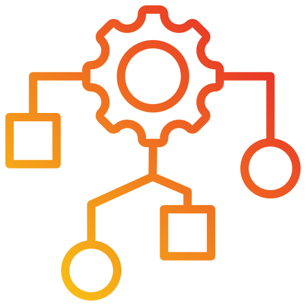

# 0x1B. C - Sorting algorithms & Big O

The primary programming language used for this project is C.

## Learning Objectives
By the end of this project, you should be able to:

- Understand at least four different sorting algorithms.
- Comprehend the concept of Big O notation and how to evaluate the time complexity of an algorithm.
- Choose the most suitable sorting algorithm for a given input.
- Understand the characteristics of stable sorting algorithms.

## Tasks

### 0. Bubble sort
- In Progress

### 1. Insertion sort
- In Progress

### 2. Selection sort
- :white_check_mark: Done

### 3. Quick sort
- In Progress
